# Pingora 权威指南

Disclaimer: 本书完全用 AI 生成，所有代码和内容均未经过本人验证，请谨慎使用。我会逐章验证。

## 简介

本书是 Cloudflare 开源的高性能代理框架 Pingora 的权威指南。Pingora 是一个用 Rust 编写的现代化、高性能、可扩展的 HTTP 代理框架，被 Cloudflare 用于其全球网络以处理大规模流量。通过本书，您将学习如何使用 Pingora 构建各种网络应用，从简单的反向代理到复杂的 API 网关。

## 写作方法

本书采用**问题驱动**的写作方法，基于对 Pingora 框架的深入探索。整个内容体系是围绕一系列精心设计的问题展开的，这些问题涵盖了从入门基础到高级应用的各个方面：

- 入门与基本设置 (如"我需要具备哪些 Rust 和网络编程的基础知识？")
- 核心代理逻辑实现 (如"如何定义一个结构体并实现 ProxyHttp trait？")
- 配置与管理 (如"如何配置 TLS 证书和私钥以启用 HTTPS？")
- 高级功能应用 (如"如何实现 HTTP 缓存和负载均衡？")
- 具体应用场景 (如"如何构建 API 网关和 WebSocket 代理？")
- 调试、测试与部署 (如"如何监控 Pingora 服务的性能指标？")

这些问题最初是通过 Gemini 2.5 Pro 模型对 Pingora 代码库的分析生成的，然后经过人工筛选和完善，确保全面覆盖 Pingora 的所有重要方面。每个章节都围绕回答相关问题展开，从而形成一个由浅入深、循序渐进的学习路径。

这种问题驱动的方法使本书能够：

1. 紧密贴合实际开发需求
2. 提供清晰的学习路径和目标
3. 确保内容的全面性和实用性
4. 帮助读者解决在实际开发中可能遇到的各种问题

## 目录结构

本书分为以下几个主要部分：

1. **基础知识**：Rust 与网络编程基础、环境搭建、基本应用结构
2. **核心概念**：Pingora 服务启动、配置、代理逻辑实现
3. **高级特性**：HTTP 缓存、负载均衡、速率限制、HTTP/2 支持等
4. **实际应用**：构建反向代理、API 网关、静态文件服务器等
5. **调试与部署**：测试、日志、监控、生产环境部署

## 学习路径

下图展示了本书的学习路径和各章节之间的关系：

```mermaid
flowchart TD
    subgraph 基础知识
        A[前言] --> B[Rust与网络编程基础]
        B --> C[环境搭建]
        C --> D[基本应用结构]
        D --> E[配置详解]
    end

    subgraph 核心概念
        E --> F[服务启动与运行]
        F --> G[ProxyHttp Trait]
        G --> H[请求上下文]
        H --> I[请求过滤与处理]
        I --> J[上游服务器选择]
        J --> K[修改请求与响应头]
        K --> L[请求与响应体处理]
        L --> M[日志与错误处理]
    end

    subgraph 高级特性
        M --> N[配置管理]
        N --> O[HTTP缓存]
        O --> P[负载均衡]
        P --> Q[连接池管理]
        Q --> R[速率限制]
        R --> S[HTTP/2与子请求]
        S --> T[监控与指标]
    end

    subgraph 实际应用
        T --> U[简单反向代理]
        U --> V[路径路由]
        V --> W[API网关]
        W --> X[静态文件服务器]
        X --> Y[WebSocket代理]
        Y --> Z[TCP代理]
    end

    subgraph 调试与部署
        Z --> AA[调试技巧]
        AA --> AB[日志管理]
        AB --> AC[测试方法]
        AC --> AD[部署与监控]
    end

    classDef core fill:#f96,stroke:#333,stroke-width:2px;
    classDef advance fill:#bbf,stroke:#333,stroke-width:2px;
    classDef app fill:#bfb,stroke:#333,stroke-width:2px;

    class G,H,I,J,K,L,M core;
    class O,P,Q,R,S,T advance;
    class U,V,W,X,Y,Z app;
```



## 使用方法

本书使用 [mdBook](https://rust-lang.github.io/mdBook/) 构建，您可以按照以下步骤在本地构建和阅读本书：

1. 安装 mdBook：

   ```bash
   cargo install mdbook
   ```

2. 克隆本仓库：

   ```bash
   git clone https://github.com/yourusername/pingora-book.git
   cd pingora-book
   ```

3. 构建并启动本地服务器：

   ```bash
   mdbook serve
   ```

4. 打开浏览器访问 `http://localhost:3000`

## 环境要求

为了充分利用本书中的示例，您需要：

- Rust 工具链（推荐使用 rustup 安装）
- 基本的网络开发知识
- 了解 HTTP 协议的基础知识
- 一个支持 Rust 的代码编辑器（如 VS Code + rust-analyzer）

## 贡献

我们欢迎对本书的贡献！如果您发现错误或者有改进建议，请：

1. 提交 Issue 描述问题或建议
2. 或者直接提交 Pull Request 贡献内容

## 许可证

本书内容采用 [CC BY-NC-SA 4.0](https://creativecommons.org/licenses/by-nc-sa/4.0/) 许可证。

## 致谢

感谢 Cloudflare 团队开源 Pingora 框架，以及所有为本书做出贡献的作者和审阅者。

---

<div align="center">
  <p>用 Rust 和 Pingora 构建下一代高性能网络应用</p>
</div>
