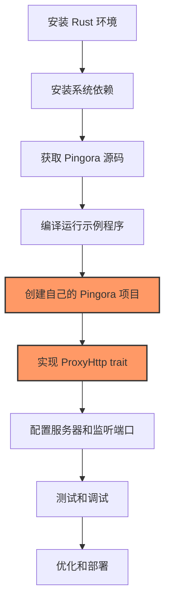

# Pingora 开发环境搭建与示例运行

Pingora 是由 Cloudflare 开源的 Rust 框架，用于构建高性能的代理服务。本章将指导你如何在开发环境中设置 Pingora，并编译运行官方提供的示例程序。

## 系统要求

Pingora 可以在多种操作系统上运行，包括：

- Linux（推荐，所有功能完全支持）
- macOS（开发环境，大部分功能支持）
- Windows（通过 WSL 支持）

在开始之前，确保你的系统满足以下基本要求：

- Rust 工具链（建议最新稳定版，至少 1.75.0 以上）
- Git
- 基本的编译工具（如 gcc, make 等）
- OpenSSL 开发库（用于 TLS 支持）

## 安装 Rust 环境

如果你尚未安装 Rust，可以使用 rustup 工具进行安装：

```bash
curl --proto '=https' --tlsv1.2 -sSf https://sh.rustup.rs | sh
```

安装完成后，确保 Rust 工具链已正确设置：

```bash
rustc --version
cargo --version
```

## 获取 Pingora 源代码

你可以通过两种方式使用 Pingora：

1. 直接在项目中添加 Pingora 依赖
2. 克隆 Pingora 源代码库进行学习或修改

### 方法一：在项目中添加 Pingora 依赖

在你的 Rust 项目的 `Cargo.toml` 文件中添加 Pingora 依赖：

```toml
[dependencies]
pingora = "0.1"
```

如果你需要使用特定的功能，可以指定相应的 feature：

```toml
[dependencies]
pingora = { version = "0.1", features = ["rustls"] }
```

### 方法二：克隆 Pingora 源代码库

```bash
git clone https://github.com/cloudflare/pingora.git
cd pingora
```

## 系统依赖安装

不同操作系统可能需要安装特定的依赖：

### Ubuntu/Debian

```bash
sudo apt update
sudo apt install -y build-essential pkg-config libssl-dev
```

### Fedora/CentOS/RHEL

```bash
sudo dnf install -y gcc make openssl-devel pkgconfig
```

### macOS (使用 Homebrew)

```bash
brew install openssl pkg-config
```

## 编译 Pingora 示例

Pingora 提供了几个示例程序，是学习其功能和 API 的良好起点。

### 编译官方示例

进入 Pingora 源代码目录后，可以编译官方提供的示例：

```bash
# 确保你在 pingora 目录下
cd pingora-proxy/examples
cargo build --release --example simple_proxy
```

这将在 `target/release/examples/` 目录下生成 `simple_proxy` 可执行文件。

### 运行简单代理示例

```bash
cargo run --release --example simple_proxy
```

默认情况下，这个简单代理将监听 8080 端口，并将所有请求转发到 `http://example.org`。你可以使用浏览器或 curl 测试它：

```bash
curl -v http://localhost:8080
```

## Pingora 示例程序详解

Pingora 提供了几个不同功能的示例程序，让我们了解它们：

### simple_proxy

这是最基本的反向代理示例，展示了如何创建一个简单的 Pingora 服务，将请求代理到单个上游服务器。

### multi_services

展示如何在一个 Pingora 实例中运行多个服务，每个服务可以有不同的处理逻辑和配置。

### peer_selection

演示如何实现自定义的上游服务器选择逻辑，包括负载均衡。

### response_filter

展示如何修改从上游服务器返回的响应。

## 使用 TLS（HTTPS）

要启用 TLS 支持，Pingora 提供了两个可选的 TLS 后端：

1. BoringSSL (OpenSSL API 兼容) - 默认选项
2. Rustls - 纯 Rust 实现的 TLS 库

要使用 Rustls，你需要在 Cargo.toml 中启用相应的 feature：

```toml
[dependencies]
pingora = { version = "0.1", features = ["rustls"], default-features = false }
```

## 配置开发环境

为了更高效地开发 Pingora 应用，建议配置以下工具：

### 编辑器/IDE

推荐使用支持 Rust 语言的编辑器或 IDE，如：

- VS Code + rust-analyzer 扩展
- IntelliJ IDEA + Rust 插件
- Vim/Neovim + rust.vim 和 rust-analyzer

### 日志级别配置

Pingora 使用 `env_logger` 进行日志记录，可以通过设置 `RUST_LOG` 环境变量来控制日志级别：

```bash
# 设置 debug 级别的日志
RUST_LOG=debug cargo run --example simple_proxy

# 只显示 pingora 相关的 info 级别日志
RUST_LOG=pingora=info cargo run --example simple_proxy
```

## 常见问题排查

### 编译错误：找不到 OpenSSL

如果遇到与 OpenSSL 相关的编译错误，可以尝试设置环境变量指向 OpenSSL 安装路径：

在 macOS 上：

```bash
export OPENSSL_DIR=$(brew --prefix openssl)
```

在 Linux 上（如果 OpenSSL 安装在非标准位置）：

```bash
export OPENSSL_DIR=/path/to/openssl
```

### 权限问题

如果你的应用需要监听低端口（如 80 或 443），可能需要 root 权限：

```bash
sudo RUST_LOG=info ./target/release/examples/simple_proxy
```

更好的方法是使用 `setcap` 为可执行文件设置特权：

```bash
sudo setcap 'cap_net_bind_service=+ep' ./target/release/examples/simple_proxy
```

## 创建你的第一个 Pingora 项目

现在，让我们创建一个简单的 Pingora 项目：

```bash
# 创建新项目
cargo new my_pingora_proxy
cd my_pingora_proxy

# 编辑 Cargo.toml 添加依赖
echo '[dependencies]
pingora = "0.1"
tokio = { version = "1", features = ["full"] }
env_logger = "0.10"' >> Cargo.toml
```

然后，编辑 `src/main.rs` 文件，添加一个简单的反向代理实现：

```rust
use pingora::prelude::*;
use std::sync::Arc;

// 定义代理服务
struct MyProxy;

impl ProxyHttp for MyProxy {
    type CTX = ();

    fn new_ctx(&self) -> Self::CTX {
        ()
    }

    fn upstream_peer(&self, _session: &mut Session, _ctx: &mut Self::CTX) -> Result<Box<HttpPeer>> {
        // 简单示例：所有请求都转发到 example.org
        let peer = HttpPeer::new("example.org", 80, false, "example.org".to_string());
        Ok(Box::new(peer))
    }
}

#[tokio::main]
async fn main() -> Result<(), Box<dyn std::error::Error>> {
    // 初始化日志
    env_logger::init();

    // 创建服务器实例
    let mut my_server = Server::new(None).await?;
    my_server.bootstrap();

    // 创建代理服务
    let proxy_service = proxy_service!(MyProxy {});
    let service_config = ServiceConfig::new().name("my_proxy");

    // 添加到服务器
    my_server.add_tcp_service(proxy_service, service_config, "0.0.0.0:8080".parse()?);

    // 启动服务器，永久运行
    my_server.run_forever();

    Ok(())
}
```

编译并运行你的第一个 Pingora 代理：

```bash
RUST_LOG=info cargo run
```

现在，你的代理服务将在 8080 端口运行，并将所有请求转发到 example.org。

## 开发流程图

以下是一个简单的 Pingora 应用开发流程：



## 总结

在本章中，我们学习了如何设置 Pingora 开发环境，编译并运行官方提供的示例程序，以及创建一个基本的 Pingora 项目。这为我们深入学习 Pingora 的核心概念和高级功能打下了基础。

在接下来的章节中，我们将探索如何构建一个最小化的 Pingora 应用，详细了解 Pingora 的配置选项，以及 Pingora 服务的启动和运行机制。
