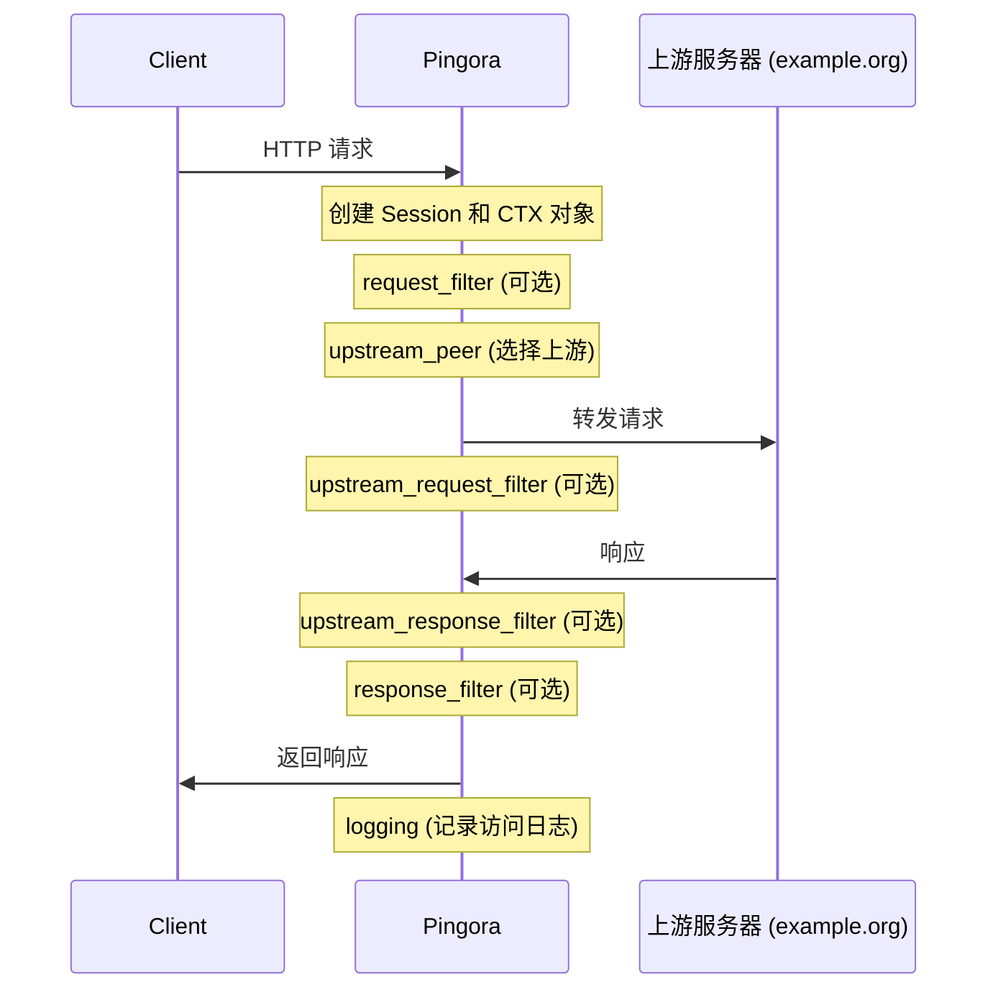

# 最小化 Pingora 应用结构：简单反向代理

Pingora 的核心功能是构建高性能的代理服务。在本章中，我们将详细介绍一个最小化的 Pingora 应用结构，以简单反向代理为例，解析其代码组织和关键组件。

## Pingora 应用的基本组成部分

一个最小的 Pingora 应用通常包含以下几个核心部分：

1. 代理逻辑的实现（通常是一个实现了 `ProxyHttp` trait 的结构体）
2. 服务器配置和初始化
3. 服务定义和注册
4. 启动和运行服务

让我们逐一解析这些组件。

## 项目结构

一个基本的 Pingora 反向代理项目结构通常如下：

```bash
simple_proxy/
├── Cargo.toml       # 项目依赖配置
├── src/
│   └── main.rs      # 主程序代码
└── pingora_conf.yaml  # (可选) 配置文件
```

### Cargo.toml

首先，让我们看看 `Cargo.toml` 文件中需要包含的基本依赖：

```toml
[package]
name = "simple_proxy"
version = "0.1.0"
edition = "2021"

[dependencies]
# Pingora 核心库
pingora = "0.1"
# 异步运行时
tokio = { version = "1", features = ["full"] }
# 日志库
env_logger = "0.10"
```

这里我们只包含了最基本的依赖：

- `pingora`：Pingora 框架本身
- `tokio`：异步运行时，带有完整功能
- `env_logger`：用于日志记录和调试

如果需要更高级的功能，可以添加 Pingora 的其他组件，例如：

```toml
# 负载均衡功能
pingora-load-balancing = "0.1"
# 缓存功能
pingora-cache = "0.1"
# 限流功能
pingora-limits = "0.1"
# 如果需要 rustls 替代 OpenSSL
pingora = { version = "0.1", features = ["rustls"], default-features = false }
```

### main.rs

接下来，让我们详细分析 `main.rs` 中的代码，这是一个最小化的反向代理实现：

```rust
use pingora::prelude::*;

// 1. 定义代理处理结构体
struct SimpleProxy;

// 2. 实现 ProxyHttp trait
impl ProxyHttp for SimpleProxy {
    // 定义上下文类型，对于简单代理可以是空元组
    type CTX = ();

    // 创建新的上下文
    fn new_ctx(&self) -> Self::CTX {
        ()
    }

    // 选择上游服务器
    fn upstream_peer(&self, _session: &mut Session, _ctx: &mut Self::CTX) -> Result<Box<HttpPeer>> {
        // 所有请求都转发到 example.org
        let peer = HttpPeer::new("example.org", 80, false, "example.org".to_string());
        Ok(Box::new(peer))
    }
}

#[tokio::main]
async fn main() -> Result<(), Box<dyn std::error::Error>> {
    // 3. 初始化日志
    env_logger::init();

    // 4. 创建服务器实例
    let mut server = Server::new(None).await?;
    server.bootstrap();

    // 5. 创建代理服务
    let proxy_service = proxy_service!(SimpleProxy {});
    let service_config = ServiceConfig::new().name("simple_proxy");

    // 6. 添加服务到服务器
    server.add_tcp_service(proxy_service, service_config, "0.0.0.0:8080".parse()?);

    // 7. 运行服务器
    server.run_forever();

    Ok(())
}
```

让我们逐步解析这段代码：

#### 1. 引入必要的模块

```rust
use pingora::prelude::*;
```

`pingora::prelude::*` 导入了 Pingora 中最常用的类型和 trait，这是使用 Pingora 的标准做法。

#### 2. 定义代理处理结构体

```rust
struct SimpleProxy;
```

这是一个空结构体，用于实现 `ProxyHttp` trait。对于简单的代理，我们不需要在结构体中存储任何状态。

#### 3. 实现 ProxyHttp trait

```rust
impl ProxyHttp for SimpleProxy {
    type CTX = ();

    fn new_ctx(&self) -> Self::CTX {
        ()
    }

    fn upstream_peer(&self, _session: &mut Session, _ctx: &mut Self::CTX) -> Result<Box<HttpPeer>> {
        let peer = HttpPeer::new("example.org", 80, false, "example.org".to_string());
        Ok(Box::new(peer))
    }
}
```

`ProxyHttp` trait 是 Pingora 代理服务的核心，它定义了代理处理请求的各个阶段。在这个最小实现中，我们只覆盖了两个必须实现的方法：

- `type CTX`：定义上下文类型，用于在请求处理的不同阶段之间共享数据。对于简单代理，我们使用空元组 `()`。
- `new_ctx()`：为每个新的请求创建一个上下文实例。
- `upstream_peer()`：选择上游服务器。这里我们简单地将所有请求转发到 `example.org` 的 80 端口。

`HttpPeer::new()` 方法接受四个参数：

- 主机名或 IP 地址
- 端口
- 是否使用 HTTPS (这里是 `false`，表示使用 HTTP)
- SNI (Server Name Indication) 值，用于 TLS 连接

#### 4. 主函数

```rust
#[tokio::main]
async fn main() -> Result<(), Box<dyn std::error::Error>> {
```

我们使用 `#[tokio::main]` 宏来简化异步运行时的设置。主函数返回一个 `Result` 类型，以便处理可能的错误。

#### 5. 初始化日志和服务器

```rust
env_logger::init();

let mut server = Server::new(None).await?;
server.bootstrap();
```

- `env_logger::init()` 初始化日志系统，可以通过 `RUST_LOG` 环境变量控制日志级别。
- `Server::new(None)` 创建一个新的服务器实例，参数为配置文件路径，`None` 表示使用默认配置。
- `server.bootstrap()` 进行服务器初始化，包括设置信号处理、线程池等。

#### 6. 创建和配置代理服务

```rust
let proxy_service = proxy_service!(SimpleProxy {});
let service_config = ServiceConfig::new().name("simple_proxy");
```

- `proxy_service!` 宏用于创建代理服务实例。
- `ServiceConfig::new().name("simple_proxy")` 创建服务配置，至少需要设置服务名称。

#### 7. 注册和启动服务

```rust
server.add_tcp_service(proxy_service, service_config, "0.0.0.0:8080".parse()?);
server.run_forever();
```

- `add_tcp_service` 方法将代理服务添加到服务器，指定服务、配置和监听地址。
- `run_forever()` 启动服务器，永久运行直到收到终止信号。

## 请求处理流程

下面的流程图展示了一个请求在 Pingora 简单反向代理中的处理过程：



每个请求都会经过一系列的处理阶段，在我们的最小实现中，只定义了必须的 `upstream_peer` 阶段，但在实际应用中，通常会根据需要实现更多阶段：

1. `request_filter`：请求过滤，可以检查和修改客户端请求
2. `upstream_peer`：选择上游服务器
3. `upstream_request_filter`：修改转发给上游的请求
4. `upstream_response_filter`：修改从上游收到的响应
5. `response_filter`：最终响应过滤
6. `logging`：记录访问日志

## 扩展基本代理功能

虽然上面的代码是一个最小化实现，但要构建实用的代理服务，通常需要增加一些功能。以下是一些常见的扩展：

### 1. 从请求中获取上游主机

在实际应用中，我们可能需要根据 HTTP 请求的 `Host` 头部决定上游服务器：

```rust
fn upstream_peer(&self, session: &mut Session, _ctx: &mut Self::CTX) -> Result<Box<HttpPeer>> {
    // 从请求中获取主机名
    let host = match session.req_header().host() {
        Some(h) => h.to_string(),
        None => return Err(Error::msg("缺少 Host 头部")),
    };

    // 解析主机名和可能的端口
    let mut host_parts = host.split(':');
    let hostname = host_parts.next().unwrap();
    let port = host_parts.next().unwrap_or("80").parse::<u16>().unwrap_or(80);

    // 创建并返回 HttpPeer
    let peer = HttpPeer::new(hostname, port, false, hostname.to_string());
    Ok(Box::new(peer))
}
```

### 2. 实现日志记录

记录请求和响应信息对于监控和调试很有帮助：

```rust
fn logging(&self, session: &mut Session, _ctx: &mut Self::CTX) {
    // 收集基本信息
    let status = session.resp_status().unwrap_or(0);
    let path = session.req_header().uri().path();
    let method = session.req_header().method().as_str();
    let upstream = session.upstream_addr().map(|a| a.to_string()).unwrap_or_else(|| "-".to_string());

    // 记录到日志
    info!(
        "{} {} {} {} -> {}",
        method, path, status, session.client_addr(), upstream
    );
}
```

### 3. 实现路径修改

有时候需要在转发到上游之前修改请求路径：

```rust
fn upstream_request_filter(&self, session: &mut Session, _ctx: &mut Self::CTX) -> Result<()> {
    // 获取原始路径
    let orig_path = session.req_header().uri().path();
    // 添加前缀
    let new_path = format!("/api{}", orig_path);

    // 修改请求路径
    session.req_header_mut().set_path(&new_path)?;

    Ok(())
}
```

## 完整的 main.rs 示例

结合上述扩展，下面是一个更完整的简单反向代理实现：

```rust
use pingora::prelude::*;
use std::sync::Arc;

// 定义代理服务
struct EnhancedProxy;

impl ProxyHttp for EnhancedProxy {
    type CTX = ();

    fn new_ctx(&self) -> Self::CTX {
        ()
    }

    // 检查和过滤请求
    fn request_filter(&self, session: &mut Session, _ctx: &mut Self::CTX) -> Result<()> {
        // 例如：阻止特定的用户代理
        if let Some(user_agent) = session.req_header().headers().get("user-agent") {
            if user_agent.to_str().unwrap_or("").contains("BadBot") {
                return Err(Error::msg("禁止的用户代理"));
            }
        }
        Ok(())
    }

    // 选择上游服务器
    fn upstream_peer(&self, session: &mut Session, _ctx: &mut Self::CTX) -> Result<Box<HttpPeer>> {
        // 根据路径选择不同的上游
        let path = session.req_header().uri().path();

        let (host, port, use_https) = if path.starts_with("/api") {
            ("api.example.com", 443, true)
        } else {
            ("www.example.com", 80, false)
        };

        let peer = HttpPeer::new(host, port, use_https, host.to_string());
        Ok(Box::new(peer))
    }

    // 修改发送到上游的请求
    fn upstream_request_filter(&self, session: &mut Session, _ctx: &mut Self::CTX) -> Result<()> {
        // 添加自定义请求头
        session.req_header_mut().headers_mut().insert(
            "X-Forwarded-By",
            "Pingora-Proxy".parse().unwrap()
        );
        Ok(())
    }

    // 修改从上游返回的响应
    fn upstream_response_filter(&self, session: &mut Session, _ctx: &mut Self::CTX) -> Result<()> {
        // 添加响应头
        session.resp_header_mut()?.headers_mut().insert(
            "X-Powered-By",
            "Pingora".parse().unwrap()
        );
        Ok(())
    }

    // 记录访问日志
    fn logging(&self, session: &mut Session, _ctx: &mut Self::CTX) {
        let status = session.resp_status().unwrap_or(0);
        let path = session.req_header().uri().path();
        let method = session.req_header().method().as_str();

        info!(
            "{} {} {} from {} to {}",
            method,
            path,
            status,
            session.client_addr(),
            session.upstream_addr().map(|a| a.to_string()).unwrap_or_else(|| "-".to_string())
        );
    }
}

#[tokio::main]
async fn main() -> Result<(), Box<dyn std::error::Error>> {
    // 初始化日志
    env_logger::init();

    // 创建服务器实例
    let mut server = Server::new(None).await?;
    server.bootstrap();

    // 创建代理服务
    let proxy_service = proxy_service!(EnhancedProxy {});
    let service_config = ServiceConfig::new()
        .name("enhanced_proxy")
        .threads(4);  // 使用 4 个工作线程

    // 添加服务到服务器并指定监听地址
    server.add_tcp_service(proxy_service, service_config, "0.0.0.0:8080".parse()?);

    // 运行服务器
    info!("启动代理服务器在 0.0.0.0:8080...");
    server.run_forever();

    Ok(())
}
```

## 直接响应（无需代理到上游）

在某些情况下，我们可能希望直接从代理服务器响应客户端，而无需转发到上游服务器。这可以在 `request_filter` 阶段实现：

```rust
fn request_filter(&self, session: &mut Session, _ctx: &mut Self::CTX) -> Result<()> {
    // 检查特定路径
    if session.req_header().uri().path() == "/health" {
        // 创建直接响应
        let resp = HttpResponse::builder()
            .status(200)
            .header("Content-Type", "application/json")
            .body(r#"{"status":"ok"}"#.into())?;

        // 设置响应并返回 Early 状态
        session.set_response(resp);
        return Err(Error::early());
    }

    Ok(())
}
```

`Error::early()` 是一个特殊的错误，它告诉 Pingora 这不是实际错误，而是提前结束处理流程的信号。

## pingora_conf.yaml 示例

虽然在小型应用中可以通过代码配置所有内容，但对于更复杂的应用，使用配置文件是一种更灵活的方式。以下是一个基本的 `pingora_conf.yaml` 配置文件示例：

```yaml
proxy:
  # 工作线程配置
  threads: 4

  # 日志配置
  logging:
    level: "info"
    format: "json"

  # 服务配置
  services:
    - name: "simple_proxy"
      listeners:
        - address: "0.0.0.0:8080"
          protocol: "http"
        - address: "0.0.0.0:8443"
          protocol: "https"
          cert: "/path/to/cert.pem"
          key: "/path/to/key.pem"
```

要使用这个配置文件，修改服务器创建代码：

```rust
let mut server = Server::new(Some("pingora_conf.yaml")).await?;
```

## 总结

在本章中，我们详细介绍了一个最小化的 Pingora 应用结构，以简单反向代理为例。我们了解了：

1. Pingora 应用的基本项目结构
2. `Cargo.toml` 中的必要依赖
3. `main.rs` 中代码的组织和功能
4. `ProxyHttp` trait 的实现及其核心方法
5. 如何扩展基本代理功能
6. 使用配置文件管理服务配置

通过这个最小化示例，你应该对 Pingora 应用的基本结构有了清晰的理解。在接下来的章节中，我们将深入探讨 Pingora 的配置选项和服务启动机制，以及更高级的代理功能。
