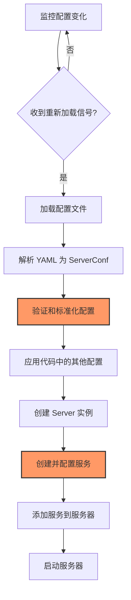

# Pingora 配置详解

Pingora 提供了灵活的配置系统，支持通过 YAML 配置文件和代码配置相结合的方式来定制服务行为。本章将详细介绍 Pingora 的配置选项，以及如何根据不同需求调整这些配置。

## 配置方式概述

Pingora 支持两种主要的配置方式：

1. **配置文件方式**：通过 YAML 格式的配置文件（通常命名为 `pingora_conf.yaml`）进行配置
2. **代码配置方式**：通过 Rust 代码直接配置服务器和服务

这两种方式可以结合使用，通常的做法是：

- 使用配置文件定义环境相关的配置（如监听地址、TLS 证书路径等）
- 使用代码配置定义应用逻辑相关的配置（如代理规则、服务行为等）

## 配置文件结构

一个完整的 Pingora 配置文件通常包含以下几个主要部分：

```yaml
proxy:
  # 全局服务器配置
  server:
    # 服务器相关配置

  # 线程池配置
  threads: 4

  # 日志配置
  logging:
    # 日志相关配置

  # 服务定义
  services:
    # 各个服务的配置
```

下面详细解析各部分配置选项。

## 全局服务器配置

全局服务器配置位于 `proxy.server` 部分，主要包含与服务器进程相关的设置：

```yaml
proxy:
  server:
    # 守护进程相关
    daemon: true                 # 是否以守护进程模式运行
    pid_file: "/var/run/pingora.pid"  # PID 文件路径

    # 权限相关
    user: "www-data"             # 运行服务的用户
    group: "www-data"            # 运行服务的用户组

    # 资源限制
    rlimit_nofile: 100000        # 文件描述符限制

    # 工作目录
    working_directory: "/var/lib/pingora"  # 工作目录路径
```

这些配置影响 Pingora 服务器的整体运行环境，特别是在生产环境中非常重要。

## 线程配置

线程配置决定了 Pingora 处理请求的并发能力：

```yaml
proxy:
  threads: 4                     # 工作线程数量
```

线程数通常应该设置为服务器 CPU 核心数（或逻辑处理器数量）的倍数。在配置文件中设置的线程数可以被代码中的配置覆盖。

## 日志配置

日志配置位于 `proxy.logging` 部分，控制日志的格式和级别：

```yaml
proxy:
  logging:
    level: "info"                # 日志级别: trace, debug, info, warn, error
    format: "json"               # 日志格式: text, json
    file: "/var/log/pingora.log" # 日志文件路径，不设置则输出到 stdout
    request_header: false        # 是否记录请求头
    response_header: false       # 是否记录响应头
```

日志级别和格式对于调试和监控服务非常重要。在生产环境中，通常建议使用 JSON 格式以便于日志解析和分析。

## 服务配置

服务配置位于 `proxy.services` 数组中，每个元素代表一个服务：

```yaml
proxy:
  services:
    - name: "web_proxy"          # 服务名称
      threads: 2                 # 服务专用线程数

      # 监听器配置
      listeners:
        - address: "0.0.0.0:80"  # 监听地址和端口
          protocol: "http"       # 协议类型: http, https, http2

        - address: "0.0.0.0:443"
          protocol: "https"
          cert: "/path/to/cert.pem"    # TLS 证书路径
          key: "/path/to/key.pem"      # TLS 私钥路径

      # 上游服务器组配置
      upstreams:
        - name: "default_group"        # 上游服务器组名称
          servers:
            - address: "backend1.example.com:8080"
              weight: 10               # 权重，用于负载均衡
            - address: "backend2.example.com:8080"
              weight: 5

          # 健康检查配置
          health_check:
            interval: 10               # 检查间隔，单位秒
            timeout: 2                 # 超时时间，单位秒
            method: "GET"              # 健康检查请求方法
            path: "/health"            # 健康检查请求路径
            expected_status: 200       # 期望的状态码
```

Pingora 允许在一个服务器实例中运行多个服务，每个服务可以有独立的配置，包括监听地址、协议、线程数等。

## TLS 配置详解

对于启用 HTTPS 的服务，TLS 配置非常重要。每个 HTTPS 监听器可以配置以下 TLS 相关选项：

```yaml
proxy:
  services:
    - name: "secure_proxy"
      listeners:
        - address: "0.0.0.0:443"
          protocol: "https"
          cert: "/path/to/cert.pem"       # TLS 证书路径
          key: "/path/to/key.pem"         # TLS 私钥路径
          ca_file: "/path/to/ca.pem"      # CA 证书路径，用于客户端证书验证

          # TLS 版本控制
          ssl_min_version: "TLSv1.2"      # 最低 TLS 版本
          ssl_max_version: "TLSv1.3"      # 最高 TLS 版本

          # 密码套件
          cipher_list: "HIGH:!aNULL:!MD5" # 密码套件列表

          # ALPN 协议
          alpn_protocols: ["h2", "http/1.1"]  # 支持的 ALPN 协议

          # 客户端证书验证
          client_cert_verify: "optional"   # none, optional, required
```

TLS 配置对服务的安全性至关重要，建议根据现代安全最佳实践进行配置，如禁用过时的 TLS 版本和不安全的密码套件。

## 通过代码配置 Pingora

除了配置文件，Pingora 也支持通过代码进行配置。以下是一个代码配置的示例：

```rust
use pingora::prelude::*;

// 创建配置
let mut server_conf = ServerConf::default();
server_conf.threads = Some(4);

// 创建服务器实例，传入配置或配置文件路径
let mut my_server =
    Server::new_with_config(server_conf, None /* 配置文件路径 */).await?;

// 配置服务
let service_config = ServiceConfig::new()
    .name("my_proxy")
    .threads(2);

// 添加服务
my_server.add_tcp_service(
    proxy_service!(MyProxy {}),
    service_config,
    "0.0.0.0:8080".parse()?
);
```

代码配置方式比配置文件更灵活，特别是对于需要动态生成配置的场景。

## 配置优先级

当同时使用配置文件和代码配置时，遵循以下优先级规则：

1. 代码中的明确配置具有最高优先级
2. 配置文件中的配置作为补充
3. 默认值作为最后的回退选项

例如，如果在代码中设置了线程数，那么配置文件中的线程数设置将被忽略。

## 常见配置示例

下面是一些常见场景的配置示例：

### 1. 基本 HTTP 代理

```yaml
proxy:
  threads: 4

  services:
    - name: "http_proxy"
      listeners:
        - address: "0.0.0.0:8080"
          protocol: "http"
```

### 2. HTTPS 代理（带 HTTP/2 支持）

```yaml
proxy:
  threads: 8

  services:
    - name: "https_proxy"
      listeners:
        - address: "0.0.0.0:443"
          protocol: "https"
          cert: "/path/to/cert.pem"
          key: "/path/to/key.pem"
          alpn_protocols: ["h2", "http/1.1"]  # 启用 HTTP/2
```

### 3. 多服务配置

```yaml
proxy:
  threads: 8

  services:
    - name: "api_proxy"
      listeners:
        - address: "0.0.0.0:8081"
          protocol: "http"

    - name: "web_proxy"
      listeners:
        - address: "0.0.0.0:8082"
          protocol: "http"
```

### 4. 使用负载均衡的配置

```yaml
proxy:
  services:
    - name: "load_balanced_proxy"
      listeners:
        - address: "0.0.0.0:8080"
          protocol: "http"

      upstreams:
        - name: "backend_servers"
          servers:
            - address: "backend1.example.com:80"
              weight: 10
            - address: "backend2.example.com:80"
              weight: 10

          load_balancing:
            algorithm: "round_robin"  # 负载均衡算法

          health_check:
            interval: 5
            path: "/health"
```

## 配置模板化

在部署多环境（如开发、测试、生产）时，可以使用配置模板和环境变量来管理不同环境的配置：

```yaml
proxy:
  threads: ${PINGORA_THREADS:-4}  # 使用环境变量，默认值为 4

  logging:
    level: "${LOG_LEVEL:-info}"

  services:
    - name: "main_proxy"
      listeners:
        - address: "${LISTEN_ADDR:-0.0.0.0}:${LISTEN_PORT:-8080}"
          protocol: "http"
```

然后在启动 Pingora 之前，设置相应的环境变量：

```bash
# 开发环境
export PINGORA_THREADS=2
export LOG_LEVEL=debug
export LISTEN_ADDR=127.0.0.1
export LISTEN_PORT=8000

# 生产环境
export PINGORA_THREADS=16
export LOG_LEVEL=info
export LISTEN_ADDR=0.0.0.0
export LISTEN_PORT=80
```

## 动态加载配置

Pingora 支持通过信号（如 SIGHUP）重新加载配置：

```rust
// 在启动服务器之前启用配置重新加载
my_server.enable_reload();
```

设置完成后，可以向 Pingora 进程发送 SIGHUP 信号以重新加载配置：

```bash
kill -HUP $(cat /var/run/pingora.pid)
```

## 配置 ProxyHttp 实现

除了服务器和服务配置外，ProxyHttp 实现本身也可以配置化：

```rust
// 定义代理配置结构体
struct ProxyConfig {
    default_upstream: String,
    timeout_ms: u64,
    add_headers: HashMap<String, String>,
}

// 带配置的代理实现
struct ConfigurableProxy {
    config: Arc<ProxyConfig>,
}

impl ConfigurableProxy {
    fn new(config: ProxyConfig) -> Self {
        Self {
            config: Arc::new(config)
        }
    }
}

impl ProxyHttp for ConfigurableProxy {
    type CTX = ();

    fn new_ctx(&self) -> Self::CTX {
        ()
    }

    fn upstream_peer(&self, _session: &mut Session, _ctx: &mut Self::CTX) -> Result<Box<HttpPeer>> {
        // 使用配置中的默认上游
        let peer = HttpPeer::new(
            &self.config.default_upstream,
            80,
            false,
            self.config.default_upstream.clone()
        );

        Ok(Box::new(peer))
    }

    // 使用配置中的超时设置
    fn upstream_timeout(&self, _session: &mut Session, _ctx: &mut Self::CTX) -> Option<Duration> {
        Some(Duration::from_millis(self.config.timeout_ms))
    }

    // 添加配置中指定的头部
    fn upstream_request_filter(&self, session: &mut Session, _ctx: &mut Self::CTX) -> Result<()> {
        for (name, value) in &self.config.add_headers {
            session.req_header_mut().headers_mut().insert(
                HeaderName::from_str(name)?,
                HeaderValue::from_str(value)?
            );
        }
        Ok(())
    }
}

// 在主函数中创建配置和代理
fn main() {
    // 创建代理配置
    let mut headers = HashMap::new();
    headers.insert("X-Proxy-Version".to_string(), "1.0".to_string());

    let proxy_config = ProxyConfig {
        default_upstream: "example.org".to_string(),
        timeout_ms: 3000,
        add_headers: headers,
    };

    // 创建代理服务
    let proxy_service = proxy_service!(ConfigurableProxy::new(proxy_config));

    // ... 其余服务器配置 ...
}
```

这种方式允许通过外部配置控制代理的行为，而不需要修改代码。

## 配置验证和默认值

在使用配置时，建议进行验证并设置合理的默认值：

```rust
// 验证并应用配置
fn apply_config(mut config: ServerConf) -> ServerConf {
    // 验证线程数
    if let Some(threads) = config.threads {
        if threads == 0 {
            eprintln!("警告: 线程数不能为 0，设置为默认值 4");
            config.threads = Some(4);
        }
    } else {
        // 设置默认线程数
        config.threads = Some(4);
    }

    // 验证其他配置...

    config
}

// 在主函数中使用
let config = load_config_from_file("pingora_conf.yaml")?;
let validated_config = apply_config(config);
let server = Server::new_with_config(validated_config, None).await?;
```

## 配置的典型使用流程

下图说明了 Pingora 配置的典型使用流程：



## 配置最佳实践

最后，总结一些 Pingora 配置的最佳实践：

1. **分离关注点**：
   - 使用配置文件存储环境相关配置（端口、路径等）
   - 使用代码配置存储业务逻辑相关配置

2. **安全配置**：
   - 对 TLS 配置遵循现代安全标准
   - 限制服务权限（使用非 root 用户运行）
   - 合理设置资源限制

3. **性能优化**：
   - 根据 CPU 核心数调整线程配置
   - 为不同服务分配适当的线程数
   - 配置合理的超时值和连接池大小

4. **可观测性**：
   - 配置详细的日志记录
   - 使用结构化日志格式（如 JSON）
   - 考虑记录关键请求信息，但避免记录敏感数据

5. **分环境配置**：
   - 使用环境变量或不同的配置文件区分环境
   - 开发环境启用详细日志，生产环境仅记录必要信息

6. **优雅降级**：
   - 配置健康检查和失败处理策略
   - 为上游服务器配置合理的超时和重试策略

7. **配置管理**：
   - 将配置纳入版本控制
   - 记录配置变更历史
   - 实施配置审查流程

遵循这些最佳实践，你可以构建出更加健壮、安全和高性能的 Pingora 服务。

## 总结

在本章中，我们详细介绍了 Pingora 的配置系统，包括配置文件结构、关键配置选项、代码配置方式以及各种使用场景的示例。通过合理配置，可以充分发挥 Pingora 的高性能特性，同时确保服务的安全性和可靠性。

在下一章中，我们将深入探讨 Pingora 服务的启动和运行机制，包括 `Server::bootstrap()` 和 `Server::run_forever()` 这两个核心方法的工作原理。
