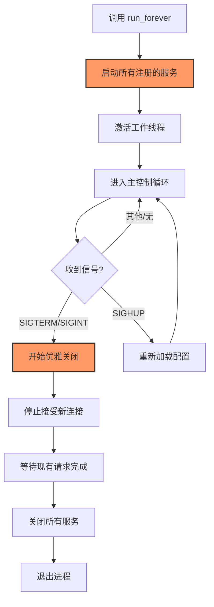
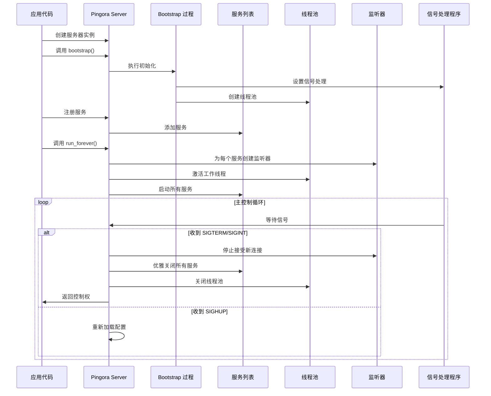

# Pingora 服务启动与运行

在 Pingora 应用中，服务的启动和运行是由 `Server::bootstrap()` 和 `Server::run_forever()` 这两个核心方法管理的。本章将深入探讨这两个方法的工作原理，以及如何组织 Pingora 的启动代码。

## Pingora 服务的生命周期

Pingora 服务的生命周期主要包括以下几个阶段：

1. 服务器实例创建
2. 引导初始化 (Bootstrap)
3. 服务注册
4. 服务启动和运行
5. 信号处理和优雅关闭

让我们从服务器实例的创建开始，逐步了解每个阶段的详情。

## 服务器实例创建

创建 Pingora 服务器实例通常有两种方式：

```rust
// 方式 1：使用默认配置或从文件加载配置
let mut server = Server::new(config_path).await?;

// 方式 2：使用代码配置
let mut server_conf = ServerConf::default();
server_conf.threads = Some(8);
let mut server = Server::new_with_config(server_conf, config_path).await?;
```

`Server::new()` 方法接受一个可选的配置文件路径参数。如果提供了配置文件路径，Pingora 将从该文件加载配置；否则，使用默认配置。

`Server::new_with_config()` 方法允许同时提供代码配置和配置文件路径。这种方式下，代码配置会覆盖配置文件中的相同选项。

无论使用哪种方式，此步骤只是创建了服务器实例，还没有进行任何初始化或启动操作。服务器实例包含了处理配置、管理服务、处理信号等的各种组件。

## 引导初始化 (Bootstrap)

创建服务器实例后，下一步是调用 `bootstrap()` 方法进行初始化：

```rust
server.bootstrap();
```

`bootstrap()` 方法是 Pingora 服务器初始化的关键步骤，它执行以下操作：

1. **日志系统初始化**：根据配置设置日志级别、格式和输出目标
2. **信号处理设置**：注册信号处理程序，用于处理 SIGTERM、SIGINT、SIGHUP 等信号
3. **守护进程配置**：如果配置为守护进程模式，将进程切换到后台运行
4. **权限设置**：根据配置设置进程的用户和组
5. **资源限制配置**：设置文件描述符限制等系统资源约束
6. **工作目录设置**：如果指定了工作目录，则切换到该目录
7. **线程池初始化**：创建和配置工作线程池
8. **监控子系统初始化**：设置内部监控和健康检查机制

以下是 `bootstrap()` 方法的简化流程图：

```mermaid
flowchart TD
    A[调用 bootstrap\(\)] --> B[日志系统初始化]
    B --> C[信号处理设置]
    C --> D{守护进程模式?}
    D -- 是 --> E[切换到后台运行]
    D -- 否 --> F[权限设置]
    E --> F
    F --> G[资源限制配置]
    G --> H[工作目录设置]
    H --> I[线程池初始化]
    I --> J[监控子系统初始化]
    J --> K[Bootstrap 完成]

    classDef highlight fill:#f96,stroke:#333,stroke-width:2px;
    class I,C highlight;
```

通过 `bootstrap()` 方法，Pingora 服务器进入就绪状态，准备接收服务注册。

### 线程池详解

线程池是 Pingora 性能的关键部分。在 `bootstrap()` 过程中，Pingora 会根据配置创建工作线程池：

```rust
// ServerConf 中的线程配置
pub struct ServerConf {
    pub threads: Option<usize>,  // 全局线程数
    // ... 其他配置项
}

// ServiceConfig 中的线程配置
pub struct ServiceConfig {
    threads: Option<usize>,  // 服务专用线程数
    // ... 其他配置项
}
```

线程池的创建逻辑如下：

1. 如果在 `ServiceConfig` 中指定了线程数，则该服务使用指定数量的专用线程
2. 否则，服务使用全局线程池，其大小由 `ServerConf.threads` 决定
3. 如果两者都未指定，则使用默认线程数（通常是系统 CPU 核心数）

每个线程都运行一个 Tokio 运行时，处理分配给它的连接和请求。这种设计使 Pingora 能够充分利用多核 CPU，同时避免线程间的竞争。

### 信号处理机制

Pingora 的信号处理是在 `bootstrap()` 阶段设置的，它允许服务器优雅地响应各种系统信号：

- **SIGTERM/SIGINT**：触发服务器优雅关闭
- **SIGHUP**：如果启用了配置重新加载功能，则重新加载配置
- **SIGUSR1/SIGUSR2**：可用于触发自定义操作（如切换日志级别）

信号处理程序运行在专用线程中，接收信号后会通过通道将信号传递给主控制循环处理。

## 服务注册

初始化完成后，下一步是注册要运行的服务。Pingora 支持添加多种类型的服务，最常见的是 TCP 服务（如 HTTP 代理）：

```rust
// 创建代理服务
let proxy_service = proxy_service!(MyProxy {});

// 创建服务配置
let service_config = ServiceConfig::new()
    .name("my_http_proxy")
    .threads(4);  // 使用 4 个专用线程

// 添加 TCP 服务并指定监听地址
server.add_tcp_service(
    proxy_service,
    service_config,
    "0.0.0.0:8080".parse()?
);
```

`add_tcp_service()` 方法将服务、配置和监听地址注册到服务器。此时，服务尚未启动，只是被添加到了服务器的服务列表中。

除了 TCP 服务外，Pingora 还支持其他类型的服务：

```rust
// 添加 HTTP 服务（通过 HttpApp）
server.add_http_service(
    pingora_http_service!(MyHttpApp {}),
    service_config,
    "0.0.0.0:8080".parse()?
);

// 添加 HTTPS 服务（需要 TLS 配置）
let tls_config = /* TLS 配置 */;
server.add_tls_service(
    proxy_service,
    service_config,
    "0.0.0.0:443".parse()?,
    tls_config
);
```

可以向同一个服务器实例添加多个服务，每个服务可以有不同的处理逻辑、配置和监听地址。

## 服务启动和运行

注册所有服务后，最后一步是启动服务器并开始处理请求：

```rust
// 启动服务器并一直运行，直到收到终止信号
server.run_forever();
```

`run_forever()` 方法是 Pingora 服务的核心运行方法，它执行以下操作：

1. **启动所有已注册的服务**：为每个服务创建监听器并开始接受连接
2. **启动工作线程**：激活线程池开始处理请求
3. **进入主控制循环**：等待信号或其他控制事件
4. **处理终止信号**：收到终止信号时，开始优雅关闭流程

以下是 `run_forever()` 方法的简化流程图：



### 服务启动过程详解

当调用 `run_forever()` 时，Pingora 会为每个注册的服务执行以下步骤：

1. **创建监听套接字**：根据服务配置的地址和端口创建套接字
2. **配置套接字选项**：设置重用地址、非阻塞模式等选项
3. **绑定地址**：将套接字绑定到指定的地址和端口
4. **开始监听**：开始监听传入的连接请求
5. **创建接收器**：为每个服务创建连接接收器，负责接受新连接
6. **分发连接**：将新连接分发给工作线程处理

每个服务的监听器都运行在自己的异步任务中，这使得多个服务可以并行接受连接。

### 线程模型和请求处理

Pingora 使用基于 Tokio 的多线程模型处理请求：

1. 监听线程接受新连接
2. 连接被分发到工作线程池中的某个线程
3. 工作线程在其 Tokio 运行时中异步处理请求
4. 请求处理完成后，结果返回给客户端

这种设计有几个重要特点：

- **多线程并行**：充分利用多核 CPU
- **非阻塞 I/O**：通过异步 I/O 提高吞吐量
- **连接一致性**：同一连接的所有请求在同一线程中处理，避免同步开销
- **负载平衡**：连接均匀分布在所有工作线程上

### 优雅关闭流程

当服务器收到 SIGTERM 或 SIGINT 信号时，会启动优雅关闭流程：

1. **停止接受新连接**：关闭所有监听套接字
2. **等待现有请求完成**：给予活跃请求一定时间完成处理
3. **超时处理**：如果请求在宽限期内未完成，可能会被强制终止
4. **关闭服务**：关闭所有服务并释放资源
5. **关闭线程池**：通知工作线程退出
6. **退出进程**：完成所有清理工作后退出

这种优雅关闭机制确保在服务停止时不会丢失正在处理的请求，对于生产环境至关重要。

## 高级服务启动模式

除了基本的启动方式外，Pingora 还支持一些高级的服务启动模式。

### 预热启动

对于高性能服务，可能需要在开始处理请求前"预热"系统。Pingora 支持通过自定义代码实现预热：

```rust
// 创建并初始化服务器
let mut server = Server::new(None).await?;
server.bootstrap();

// 注册服务
// ... 添加服务 ...

// 预热：预先分配资源或建立连接
let prewarming = async {
    // 例如，预先建立与上游服务器的连接池
    for upstream in &upstreams {
        let _ = establish_connection_pool(upstream, 10).await;
    }

    // 或预热内部缓存
    let _ = warm_up_cache().await;

    // 预热完成
    info!("预热完成，服务准备就绪");
};

// 执行预热任务
tokio::spawn(prewarming);

// 启动服务
server.run_forever();
```

预热可以减少服务启动后的冷启动延迟，提高初期的性能表现。

### 滚动重启

在需要零停机更新服务时，可以使用滚动重启模式：

```rust
// 启用热重启功能
server.enable_hot_restart();

// 正常启动服务
server.run_forever();
```

启用热重启后，当服务收到特定信号时，会执行以下步骤：

1. 启动新的服务进程
2. 新进程接管监听套接字
3. 旧进程停止接受新连接
4. 旧进程等待现有请求完成
5. 旧进程退出

这种方式允许在不中断服务的情况下更新应用程序。

## 服务监控与健康检查

Pingora 提供了内置的监控和健康检查机制，可以在服务启动时配置：

```rust
// 启用健康检查服务
let health_check_service = pingora_http_service!(HealthCheck::new());
let health_config = ServiceConfig::new().name("health_check");

server.add_http_service(
    health_check_service,
    health_config,
    "127.0.0.1:8081".parse()?
);

// 启用指标服务
let metrics_service = pingora_http_service!(Metrics::new());
let metrics_config = ServiceConfig::new().name("metrics");

server.add_http_service(
    metrics_service,
    metrics_config,
    "127.0.0.1:9091".parse()?
);

// 正常启动服务
server.run_forever();
```

这些监控服务可以提供实时的健康状态和性能指标，对于生产环境的可观测性至关重要。

## 启动配置的最佳实践

根据实际经验，以下是一些 Pingora 服务启动的最佳实践：

1. **合理设置线程数**：
   - 全局线程数通常设置为 CPU 核心数的 1-2 倍
   - 为 CPU 密集型服务分配专用线程
   - 避免过多线程导致上下文切换开销

2. **资源限制设置**：
   - 设置足够大的文件描述符限制（通常至少 10000）
   - 考虑内存限制和 CPU 亲和性设置
   - 设置合理的连接超时和请求超时

3. **服务隔离**：
   - 将不同类型的服务（如代理、API、监控）分开配置
   - 考虑为关键服务分配专用线程
   - 使用不同的 IP 或端口隔离内部和外部服务

4. **启动顺序**：
   - 先启动内部服务（如监控、管理接口）
   - 然后启动依赖的后台服务（如健康检查）
   - 最后启动面向外部的主服务

5. **错误处理**：
   - 在启动过程中捕获并正确处理错误
   - 提供明确的错误信息和建议
   - 考虑实现自动恢复机制

## 完整的服务启动示例

下面是一个包含完整启动流程的 Pingora 服务示例：

```rust
use pingora::prelude::*;
use std::sync::Arc;

// 定义代理服务
struct MyProxy;

impl ProxyHttp for MyProxy {
    type CTX = ();

    fn new_ctx(&self) -> Self::CTX {
        ()
    }

    fn upstream_peer(&self, _session: &mut Session, _ctx: &mut Self::CTX) -> Result<Box<HttpPeer>> {
        let peer = HttpPeer::new("example.org", 80, false, "example.org".to_string());
        Ok(Box::new(peer))
    }

    // 其他方法...
}

#[tokio::main]
async fn main() -> Result<(), Box<dyn std::error::Error>> {
    // 初始化日志
    env_logger::init();

    // 1. 创建配置
    let mut server_conf = ServerConf::default();
    server_conf.threads = Some(8);

    // 2. 创建服务器实例
    let mut server = Server::new_with_config(server_conf, None).await?;

    // 3. 引导初始化
    server.bootstrap();

    // 4. 启用热重启（可选）
    server.enable_hot_restart();

    // 5. 启用配置重新加载（可选）
    server.enable_reload();

    // 6. 创建并配置代理服务
    let proxy_service = proxy_service!(MyProxy {});
    let service_config = ServiceConfig::new()
        .name("main_proxy")
        .threads(4);

    // 7. 添加代理服务
    server.add_tcp_service(
        proxy_service,
        service_config,
        "0.0.0.0:8080".parse()?
    );

    // 8. 创建并配置健康检查服务
    let health_service = pingora_http_service!(HealthCheck::new());
    let health_config = ServiceConfig::new().name("health");

    // 9. 添加健康检查服务
    server.add_http_service(
        health_service,
        health_config,
        "127.0.0.1:8081".parse()?
    );

    // 10. 执行预热任务（可选）
    let prewarming = async {
        // 预热逻辑
        tokio::time::sleep(tokio::time::Duration::from_secs(1)).await;
        info!("预热完成");
    };
    tokio::spawn(prewarming).await?;

    // 11. 记录启动信息
    info!("服务启动，监听地址: 0.0.0.0:8080");

    // 12. 启动服务器并永久运行
    server.run_forever();

    Ok(())
}
```

这个例子展示了一个包含完整启动流程的 Pingora 服务，包括配置、初始化、服务注册和启动。实际应用中，可以根据需要添加或删除某些步骤。

## 启动流程的详细时序图

下面的时序图展示了 Pingora 服务启动过程中各组件之间的交互：



## 总结

本章详细介绍了 Pingora 服务的启动和运行机制，包括 `Server::bootstrap()` 和 `Server::run_forever()` 这两个核心方法的工作原理。我们了解了服务器实例的创建、引导初始化、服务注册和启动运行的完整流程，以及各种高级功能和最佳实践。

通过深入理解这些机制，你可以更好地组织 Pingora 应用的启动代码，优化服务性能，并实现高可用的生产部署。

在后续章节中，我们将开始探讨 Pingora 的更多高级功能，如实现核心代理逻辑、利用负载均衡、缓存以及构建特定应用场景的解决方案。
