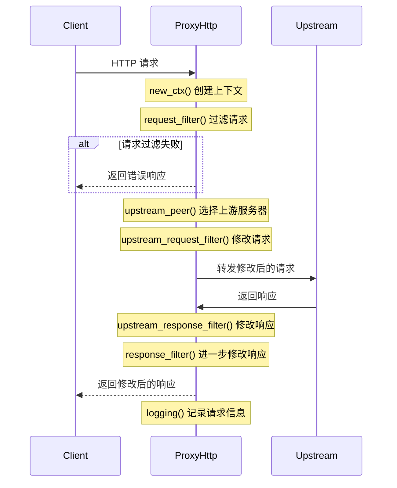

# 实现核心代理逻辑 (ProxyHttp Trait)

Pingora 的核心功能是通过实现 `ProxyHttp` trait 来定义的。本章将详细介绍如何定义一个结构体并为其实现 `ProxyHttp` trait，以便定制代理行为。

## ProxyHttp Trait 概述

`ProxyHttp` trait 是 Pingora 中最核心的接口，它定义了 HTTP 代理处理请求的各个阶段和行为。通过实现这个 trait，你可以控制代理如何处理客户端请求、选择上游服务器、修改请求和响应等。

`ProxyHttp` trait 的定义大致如下（简化版）：

```rust
pub trait ProxyHttp {
    type CTX: Send;

    fn new_ctx(&self) -> Self::CTX;

    // 请求处理阶段
    fn request_filter(&self, session: &mut Session, ctx: &mut Self::CTX) -> Result<()> { Ok(()) }
    fn upstream_peer(&self, session: &mut Session, ctx: &mut Self::CTX) -> Result<Box<dyn Peer>>;
    fn upstream_request_filter(&self, session: &mut Session, ctx: &mut Self::CTX) -> Result<()> { Ok(()) }

    // 响应处理阶段
    fn upstream_response_filter(&self, session: &mut Session, ctx: &mut Self::CTX) -> Result<()> { Ok(()) }
    fn response_filter(&self, session: &mut Session, ctx: &mut Self::CTX) -> Result<()> { Ok(()) }

    // 请求/响应体处理
    fn request_body_filter(&self, chunk: &mut BodyChunk, session: &mut Session, ctx: &mut Self::CTX) -> Result<()> { Ok(()) }
    fn upstream_response_body_filter(&self, chunk: &mut BodyChunk, session: &mut Session, ctx: &mut Self::CTX) -> Result<()> { Ok(()) }
    fn response_body_filter(&self, chunk: &mut BodyChunk, session: &mut Session, ctx: &mut Self::CTX) -> Result<()> { Ok(()) }

    // 缓存相关
    fn request_cache_filter(&self, session: &mut Session, ctx: &mut Self::CTX) -> CacheLookupDecision { CacheLookupDecision::Skip }
    fn cache_key_callback(&self, session: &mut Session, ctx: &mut Self::CTX) -> Result<CacheKey> { Err(Error::msg("Not implemented")) }
    fn response_cache_filter(&self, session: &mut Session, ctx: &mut Self::CTX) -> CacheStoreDecision { CacheStoreDecision::Skip }

    // 错误处理
    fn fail_to_connect(&self, session: &mut Session, ctx: &mut Self::CTX, err: &Error) -> Option<RequestAction> { None }
    fn error_while_proxy(&self, session: &mut Session, ctx: &mut Self::CTX, err: &Error) -> Option<RequestAction> { None }
    fn fail_to_proxy(&self, session: &mut Session, ctx: &mut Self::CTX, error_code: u16) -> Option<RequestAction> { None }

    // 日志
    fn logging(&self, session: &mut Session, ctx: &mut Self::CTX) {}

    // 超时设置
    fn upstream_timeout(&self, _session: &mut Session, _ctx: &mut Self::CTX) -> Option<Duration> { None }
    fn read_client_timeout(&self, _session: &mut Session, _ctx: &mut Self::CTX) -> Option<Duration> { None }
}
```

大多数方法都有默认实现，这意味着你只需要实现必要的方法，如 `new_ctx()` 和 `upstream_peer()`，其他方法可以根据需要选择性地覆盖。

## 定义代理结构体

首先，需要定义一个结构体来实现 `ProxyHttp` trait。这个结构体可以根据需要包含任意状态或配置：

```rust
use pingora::prelude::*;
use std::sync::Arc;

// 简单代理结构体，无需状态
struct SimpleProxy;

// 带配置的代理结构体
struct ConfigurableProxy {
    upstream_host: String,
    upstream_port: u16,
    use_https: bool,
    add_headers: Arc<HashMap<String, String>>,
}

impl ConfigurableProxy {
    fn new(host: String, port: u16, use_https: bool) -> Self {
        Self {
            upstream_host: host,
            upstream_port: port,
            use_https,
            add_headers: Arc::new(HashMap::new()),
        }
    }

    fn with_headers(mut self, headers: HashMap<String, String>) -> Self {
        self.add_headers = Arc::new(headers);
        self
    }
}
```

在这个例子中，我们定义了两种代理结构体：

- `SimpleProxy`: 一个不需要状态的简单代理
- `ConfigurableProxy`: 一个包含上游主机、端口、协议和自定义头部的可配置代理

## 实现 ProxyHttp Trait

### 必需方法实现

对于任何 `ProxyHttp` 实现，至少需要实现 `new_ctx()` 和 `upstream_peer()` 这两个方法：

```rust
// 为 SimpleProxy 实现 ProxyHttp
impl ProxyHttp for SimpleProxy {
    // 定义上下文类型，简单代理使用空元组
    type CTX = ();

    // 创建新的上下文
    fn new_ctx(&self) -> Self::CTX {
        ()
    }

    // 选择上游服务器
    fn upstream_peer(&self, _session: &mut Session, _ctx: &mut Self::CTX) -> Result<Box<dyn Peer>> {
        // 所有请求都转发到 example.org
        let peer = HttpPeer::new("example.org", 80, false, "example.org".to_string());
        Ok(Box::new(peer))
    }
}

// 为 ConfigurableProxy 实现 ProxyHttp
impl ProxyHttp for ConfigurableProxy {
    // 定义上下文类型，可以使用自定义结构体，这里简单使用空元组
    type CTX = ();

    fn new_ctx(&self) -> Self::CTX {
        ()
    }

    fn upstream_peer(&self, _session: &mut Session, _ctx: &mut Self::CTX) -> Result<Box<dyn Peer>> {
        // 使用配置中的上游服务器信息
        let peer = HttpPeer::new(
            &self.upstream_host,
            self.upstream_port,
            self.use_https,
            self.upstream_host.clone()
        );
        Ok(Box::new(peer))
    }
}
```

### 请求处理阶段

`request_filter()` 方法允许你在请求转发到上游之前检查和修改客户端请求：

```rust
impl ProxyHttp for ConfigurableProxy {
    // ...继续前面的实现...

    fn request_filter(&self, session: &mut Session, _ctx: &mut Self::CTX) -> Result<()> {
        // 检查请求方法，只允许 GET 和 POST
        let method = session.req_header().method();
        if method != http::Method::GET && method != http::Method::POST {
            return Err(Error::msg("只允许 GET 和 POST 请求"));
        }

        // 检查特定的头部
        if let Some(user_agent) = session.req_header().headers().get("user-agent") {
            if user_agent.to_str().unwrap_or("").contains("BadBot") {
                return Err(Error::msg("禁止的用户代理"));
            }
        }

        Ok(())
    }
}
```

`upstream_request_filter()` 方法允许你在请求发送到上游之前修改请求：

```rust
impl ProxyHttp for ConfigurableProxy {
    // ...继续前面的实现...

    fn upstream_request_filter(&self, session: &mut Session, _ctx: &mut Self::CTX) -> Result<()> {
        // 添加自定义请求头
        for (name, value) in self.add_headers.iter() {
            session.req_header_mut().headers_mut().insert(
                HeaderName::from_str(name)?,
                HeaderValue::from_str(value)?
            );
        }

        // 添加 X-Forwarded-For 头部
        if let Some(client_ip) = session.client_addr().ip() {
            session.req_header_mut().headers_mut().insert(
                HeaderName::from_static("x-forwarded-for"),
                HeaderValue::from_str(&client_ip.to_string())?
            );
        }

        Ok(())
    }
}
```

### 响应处理阶段

`upstream_response_filter()` 和 `response_filter()` 方法允许你修改从上游服务器返回的响应：

```rust
impl ProxyHttp for ConfigurableProxy {
    // ...继续前面的实现...

    fn upstream_response_filter(&self, session: &mut Session, _ctx: &mut Self::CTX) -> Result<()> {
        // 获取响应头，如果没有响应则返回错误
        let resp_header = session.resp_header_mut()?;

        // 添加自定义响应头
        resp_header.headers_mut().insert(
            HeaderName::from_static("x-proxy-by"),
            HeaderValue::from_static("pingora")
        );

        // 修改响应的内容类型
        if resp_header.headers().contains_key("content-type") {
            if let Some(ct) = resp_header.headers().get("content-type") {
                if ct.to_str().unwrap_or("").contains("text/html") {
                    // 设置缓存控制头部
                    resp_header.headers_mut().insert(
                        HeaderName::from_static("cache-control"),
                        HeaderValue::from_static("public, max-age=3600")
                    );
                }
            }
        }

        Ok(())
    }
}
```

### 请求/响应体处理

`request_body_filter()` 和 `response_body_filter()` 方法允许你检查和修改请求和响应的主体：

```rust
impl ProxyHttp for ConfigurableProxy {
    // ...继续前面的实现...

    fn request_body_filter(&self, chunk: &mut BodyChunk, _session: &mut Session, _ctx: &mut Self::CTX) -> Result<()> {
        // 这个示例仅做检查，不修改内容
        if let BodyChunk::Chunk(data) = chunk {
            // 检查请求体大小
            if data.len() > 1_000_000 {  // 1MB
                return Err(Error::msg("请求体过大"));
            }

            // 可以在这里检查或修改请求体内容
        }

        Ok(())
    }

    fn upstream_response_body_filter(&self, chunk: &mut BodyChunk, _session: &mut Session, _ctx: &mut Self::CTX) -> Result<()> {
        // 示例：假设我们想替换响应中的某些文本
        if let BodyChunk::Chunk(data) = chunk {
            // 这只是一个简单的示例，实际应用中需要考虑更多的边界情况
            // 例如，要替换的文本可能跨多个块，或者涉及到编码问题
            let mut data_str = String::from_utf8_lossy(data).to_string();
            data_str = data_str.replace("example", "pingora-example");
            *data = data_str.into_bytes();
        }

        Ok(())
    }
}
```

### 错误处理

在请求处理过程中，可能会发生各种错误，比如无法连接到上游服务器、上游服务器返回错误等。通过实现错误处理方法，可以自定义错误处理逻辑：

```rust
impl ProxyHttp for ConfigurableProxy {
    // ...继续前面的实现...

    fn fail_to_connect(&self, session: &mut Session, _ctx: &mut Self::CTX, err: &Error) -> Option<RequestAction> {
        // 当无法连接到上游服务器时，可以尝试重定向到备用服务器
        let fallback_response = HttpResponse::builder()
            .status(307)  // Temporary Redirect
            .header("Location", "https://backup-server.example.com")
            .body("无法连接到主服务器，正在重定向到备用服务器...".into())
            .unwrap();

        session.set_response(fallback_response);
        Some(RequestAction::Response)
    }

    fn error_while_proxy(&self, session: &mut Session, _ctx: &mut Self::CTX, err: &Error) -> Option<RequestAction> {
        // 当代理过程中出错时的处理
        warn!("代理过程中出错: {}", err);

        // 可以返回自定义错误页面
        let error_response = HttpResponse::builder()
            .status(500)  // Internal Server Error
            .header("Content-Type", "text/html; charset=utf-8")
            .body(format!("<html><body><h1>服务器内部错误</h1><p>{}</p></body></html>", err).into())
            .unwrap();

        session.set_response(error_response);
        Some(RequestAction::Response)
    }
}
```

### 日志记录

`logging()` 方法用于记录请求处理的相关信息：

```rust
impl ProxyHttp for ConfigurableProxy {
    // ...继续前面的实现...

    fn logging(&self, session: &mut Session, _ctx: &mut Self::CTX) {
        // 收集请求信息
        let method = session.req_header().method().as_str();
        let uri = session.req_header().uri().to_string();
        let status = session.resp_status().unwrap_or(0);
        let client_ip = session.client_addr().to_string();
        let upstream = session.upstream_addr().map(|a| a.to_string()).unwrap_or_else(|| "-".to_string());

        // 计算请求处理时间
        let start_time = session.start_time();
        let end_time = Instant::now();
        let duration = end_time.duration_since(start_time);
        let duration_ms = duration.as_secs() * 1000 + duration.subsec_millis() as u64;

        // 记录日志
        info!(
            "{} {} {} {} -> {} ({}ms)",
            method, uri, status, client_ip, upstream, duration_ms
        );
    }
}
```

## 请求处理流程

下面的流程图展示了一个请求在 Pingora `ProxyHttp` 实现中的完整处理流程：



## 多阶段过滤器实现模式

在实际应用中，通常会将代理逻辑分解为多个组件，每个组件负责特定的功能。这可以通过组合模式来实现：

```rust
// 定义一个请求过滤器 trait
trait RequestFilter: Send + Sync {
    fn filter(&self, session: &mut Session) -> Result<()>;
}

// 实现一些具体的过滤器
struct MethodFilter {
    allowed_methods: Vec<http::Method>,
}

impl RequestFilter for MethodFilter {
    fn filter(&self, session: &mut Session) -> Result<()> {
        let method = session.req_header().method();
        if !self.allowed_methods.contains(method) {
            return Err(Error::msg(format!("不允许的方法: {}", method)));
        }
        Ok(())
    }
}

struct UserAgentFilter {
    blocked_patterns: Vec<String>,
}

impl RequestFilter for UserAgentFilter {
    fn filter(&self, session: &mut Session) -> Result<()> {
        if let Some(user_agent) = session.req_header().headers().get("user-agent") {
            let ua_str = user_agent.to_str().unwrap_or("");
            for pattern in &self.blocked_patterns {
                if ua_str.contains(pattern) {
                    return Err(Error::msg(format!("阻止的用户代理: {}", ua_str)));
                }
            }
        }
        Ok(())
    }
}

// 组合多个过滤器的代理实现
struct FilteringProxy {
    request_filters: Vec<Box<dyn RequestFilter>>,
    upstream_host: String,
    upstream_port: u16,
}

impl FilteringProxy {
    fn new(host: String, port: u16) -> Self {
        Self {
            request_filters: Vec::new(),
            upstream_host: host,
            upstream_port: port,
        }
    }

    fn add_filter(&mut self, filter: Box<dyn RequestFilter>) {
        self.request_filters.push(filter);
    }
}

impl ProxyHttp for FilteringProxy {
    type CTX = ();

    fn new_ctx(&self) -> Self::CTX {
        ()
    }

    fn request_filter(&self, session: &mut Session, _ctx: &mut Self::CTX) -> Result<()> {
        // 应用所有注册的过滤器
        for filter in &self.request_filters {
            filter.filter(session)?;
        }
        Ok(())
    }

    fn upstream_peer(&self, _session: &mut Session, _ctx: &mut Self::CTX) -> Result<Box<dyn Peer>> {
        let peer = HttpPeer::new(
            &self.upstream_host,
            self.upstream_port,
            false,
            self.upstream_host.clone()
        );
        Ok(Box::new(peer))
    }
}

// 使用示例
fn main() {
    // 创建代理
    let mut proxy = FilteringProxy::new("example.org".to_string(), 80);

    // 添加过滤器
    let method_filter = MethodFilter {
        allowed_methods: vec![http::Method::GET, http::Method::POST],
    };
    proxy.add_filter(Box::new(method_filter));

    let ua_filter = UserAgentFilter {
        blocked_patterns: vec!["BadBot".to_string(), "EvilCrawler".to_string()],
    };
    proxy.add_filter(Box::new(ua_filter));

    // 创建代理服务
    let proxy_service = proxy_service!(proxy);

    // ... 配置和启动服务 ...
}
```

这种模式允许你将代理逻辑分解为可重用的组件，便于维护和扩展。

## 总结

本章介绍了如何定义一个结构体并为其实现 `ProxyHttp` trait，以定制代理行为。主要内容包括：

1. `ProxyHttp` trait 的基本结构和主要方法
2. 定义代理结构体并实现核心方法
3. 请求和响应的处理阶段，以及如何在各个阶段修改内容
4. 错误处理和日志记录
5. 多阶段过滤器的实现模式

在后续章节中，我们将深入探讨 ProxyHttp 的各个方法，包括上下文管理、请求过滤、上游选择、请求和响应处理等。
