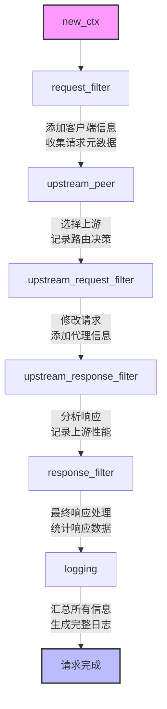

# Pingora 服务的请求处理上下文

在 Pingora 的请求处理流程中，一个关键概念是请求上下文（Context，简称 CTX）。本章将详细介绍 `ProxyHttp::new_ctx()` 方法的目的以及如何设计和使用 CTX 结构体来在请求处理的不同阶段共享数据。

## 上下文的作用

在 HTTP 代理处理过程中，一个请求会经历多个阶段：请求过滤、选择上游服务器、修改请求、处理响应等。有时需要在这些不同阶段之间共享信息，例如：

1. 在请求过滤阶段提取的信息（如用户 ID）可能在后续阶段需要使用
2. 在某个阶段进行的计算结果需要在其他阶段重用
3. 记录请求处理过程中的中间状态，用于最终的日志记录或监控

这就是请求上下文（CTX）的作用：它是一个与请求关联的数据结构，贯穿请求的整个生命周期，用于在处理阶段之间共享数据。

## ProxyHttp::new_ctx() 方法

`ProxyHttp` trait 定义了一个关联类型 `CTX` 和一个 `new_ctx()` 方法：

```rust
pub trait ProxyHttp {
    type CTX: Send;

    fn new_ctx(&self) -> Self::CTX;

    // 其他方法...
}
```

`type CTX: Send` 声明了一个关联类型，它必须实现 `Send` trait（表示可以安全地在线程间传递）。这是因为 Pingora 是多线程框架，请求可能在不同线程之间处理。

`new_ctx()` 方法的目的是为每个新请求创建一个新的上下文实例。当 Pingora 接收到一个新请求时，它会调用 `new_ctx()` 方法创建上下文，然后将这个上下文传递给请求处理的各个阶段。

## 设计 CTX 结构体

### 最简单的上下文

对于非常简单的代理，可能不需要在阶段之间共享任何数据，此时可以使用空元组作为上下文类型：

```rust
struct SimpleProxy;

impl ProxyHttp for SimpleProxy {
    type CTX = ();

    fn new_ctx(&self) -> Self::CTX {
        ()
    }

    // 其他方法...
}
```

### 设计基本的上下文结构体

对于大多数实际应用，我们会定义一个自定义结构体作为上下文：

```rust
// 定义上下文结构体
struct ProxyContext {
    // 请求相关信息
    request_id: String,
    start_time: Instant,
    client_type: Option<String>,

    // 路由决策相关
    selected_upstream: Option<String>,
    routing_tags: Vec<String>,

    // 统计和监控
    request_size: usize,
    response_size: usize,
    processing_time: HashMap<String, Duration>,
}

impl ProxyContext {
    // 创建新的上下文实例
    fn new() -> Self {
        Self {
            request_id: Uuid::new_v4().to_string(),
            start_time: Instant::now(),
            client_type: None,
            selected_upstream: None,
            routing_tags: Vec::new(),
            request_size: 0,
            response_size: 0,
            processing_time: HashMap::new(),
        }
    }

    // 添加一个路由标签
    fn add_tag(&mut self, tag: &str) {
        self.routing_tags.push(tag.to_string());
    }

    // 记录处理阶段的时间
    fn record_time(&mut self, phase: &str) {
        let now = Instant::now();
        let duration = now.duration_since(self.start_time);
        self.processing_time.insert(phase.to_string(), duration);
    }
}

// 使用自定义上下文的代理
struct AdvancedProxy;

impl ProxyHttp for AdvancedProxy {
    type CTX = ProxyContext;

    fn new_ctx(&self) -> Self::CTX {
        ProxyContext::new()
    }

    // 其他方法...
}
```

在这个例子中，`ProxyContext` 结构体包含了各种可能在请求处理过程中需要共享的信息。

### 在处理阶段中使用上下文

一旦定义了上下文结构体，你可以在各个处理阶段中使用它：

```rust
impl ProxyHttp for AdvancedProxy {
    type CTX = ProxyContext;

    fn new_ctx(&self) -> Self::CTX {
        ProxyContext::new()
    }

    fn request_filter(&self, session: &mut Session, ctx: &mut Self::CTX) -> Result<()> {
        // 记录请求过滤阶段开始时间
        ctx.record_time("request_filter_start");

        // 识别客户端类型
        if let Some(user_agent) = session.req_header().headers().get("user-agent") {
            let ua_str = user_agent.to_str().unwrap_or("");
            if ua_str.contains("Mozilla") {
                ctx.client_type = Some("browser".to_string());
            } else if ua_str.contains("bot") || ua_str.contains("Bot") {
                ctx.client_type = Some("bot".to_string());
            } else {
                ctx.client_type = Some("other".to_string());
            }
        }

        // 根据客户端类型添加标签
        if let Some(ref client_type) = ctx.client_type {
            ctx.add_tag(client_type);
        }

        // 记录请求大小
        ctx.request_size = session.req_header().headers().len();

        // 记录请求过滤阶段结束时间
        ctx.record_time("request_filter_end");

        Ok(())
    }

    fn upstream_peer(&self, session: &mut Session, ctx: &mut Self::CTX) -> Result<Box<dyn Peer>> {
        // 记录上游选择阶段开始时间
        ctx.record_time("upstream_peer_start");

        // 根据请求路径和上下文中的标签选择上游
        let path = session.req_header().uri().path();

        let (host, port, use_https) = if path.starts_with("/api") {
            ctx.add_tag("api");
            ctx.selected_upstream = Some("api_server".to_string());
            ("api.example.com", 443, true)
        } else if ctx.routing_tags.contains(&"bot".to_string()) {
            ctx.selected_upstream = Some("bot_server".to_string());
            ("bot.example.com", 80, false)
        } else {
            ctx.selected_upstream = Some("web_server".to_string());
            ("www.example.com", 80, false)
        };

        // 记录上游选择阶段结束时间
        ctx.record_time("upstream_peer_end");

        let peer = HttpPeer::new(host, port, use_https, host.to_string());
        Ok(Box::new(peer))
    }

    fn logging(&self, session: &mut Session, ctx: &mut Self::CTX) {
        // 记录日志阶段时间
        ctx.record_time("logging");

        // 计算总处理时间
        let total_time = ctx.processing_time.get("logging").unwrap_or(&Duration::from_secs(0))
            .checked_sub(*ctx.processing_time.get("request_filter_start").unwrap_or(&Duration::from_secs(0)))
            .unwrap_or(Duration::from_secs(0));

        // 获取响应状态码
        let status = session.resp_status().unwrap_or(0);

        // 生成日志条目
        info!(
            "请求处理完成: ID={}, 路径={}, 状态码={}, 上游={}, 标签={:?}, 总耗时={}ms",
            ctx.request_id,
            session.req_header().uri().path(),
            status,
            ctx.selected_upstream.as_deref().unwrap_or("-"),
            ctx.routing_tags,
            total_time.as_millis()
        );
    }

    // 其他方法...
}
```

在这个例子中，我们在不同的处理阶段使用上下文来:

1. 记录每个阶段的处理时间
2. 识别客户端类型并添加标签
3. 根据收集的信息选择上游服务器
4. 在日志中记录详细的请求处理信息

## 上下文设计的最佳实践

设计有效的请求上下文需要考虑以下几点：

### 1. 保持上下文结构精简

上下文应该只包含必要的信息，避免存储可以通过其他方式获取的数据。过大的上下文会增加内存使用和 CPU 缓存压力。

```rust
// 好的做法：精简的上下文
struct GoodContext {
    request_id: String,
    routing_decision: Option<String>,
    timing_marks: Vec<(String, Instant)>,
}

// 不好的做法：存储冗余或不必要的信息
struct BadContext {
    request_id: String,
    full_request_headers: HashMap<String, String>, // 冗余，可以从 session 获取
    request_body: Vec<u8>,                         // 可能很大，应避免存储
    complete_uri: String,                          // 冗余，可以从 session 获取
    // ...
}
```

### 2. 使用合适的数据结构

为上下文中的不同类型的数据选择合适的数据结构：

```rust
struct OptimizedContext {
    // 使用 SmallVec 优化小数组的情况
    tags: smallvec::SmallVec<[String; 4]>, // 通常只有少量标签，避免堆分配

    // 使用枚举表示可选状态，比 Option<String> 更清晰
    client_category: ClientCategory,

    // 使用 FnvHashMap 可能比标准 HashMap 更适合小型哈希表
    timing: fnv::FnvHashMap<String, Instant>,
}

enum ClientCategory {
    Unknown,
    Browser { is_mobile: bool },
    Bot { name: String },
    ApiClient { version: String },
}
```

### 3. 线程安全考虑

记住上下文必须实现 `Send` trait，这意味着它必须能够安全地在线程间传递：

```rust
// 错误做法：使用非 Send 类型
struct NonSendContext {
    // Rc 不是 Send，这会导致编译错误
    shared_data: std::rc::Rc<SomeData>,
}

// 正确做法：使用 Send 类型
struct ThreadSafeContext {
    // Arc 是 Send，可以安全地在线程间传递
    shared_data: std::sync::Arc<SomeData>,
}
```

### 4. 分阶段收集信息

设计上下文时，考虑信息在各个阶段如何流动和累积：



### 5. 组织多个相关的上下文字段

对于复杂的上下文，可以将相关字段组织成子结构体：

```rust
struct StructuredContext {
    // 请求元数据
    metadata: RequestMetadata,

    // 路由信息
    routing: RoutingInfo,

    // 性能指标
    metrics: PerformanceMetrics,

    // 业务逻辑相关
    business: BusinessContext,
}

struct RequestMetadata {
    id: String,
    start_time: Instant,
    client_ip: std::net::IpAddr,
    user_agent_category: String,
}

struct RoutingInfo {
    selected_upstream: Option<String>,
    routing_algorithm: String,
    route_cache_hit: bool,
}

struct PerformanceMetrics {
    phase_timings: HashMap<String, Duration>,
    request_size: usize,
    response_size: usize,
    upstream_response_time: Duration,
}

struct BusinessContext {
    user_id: Option<String>,
    account_type: Option<String>,
    rate_limited: bool,
    auth_status: AuthStatus,
}

enum AuthStatus {
    Anonymous,
    Authenticated { level: u8 },
    Failed { reason: String },
}
```

## 跨请求共享数据

上下文专注于单个请求的生命周期内的数据共享。对于需要在多个请求之间共享的数据（如缓存、配置、统计信息），应该将其存储在代理结构体本身中，并使用适当的同步机制：

```rust
struct SharedProxyState {
    config: RwLock<ProxyConfig>,
    stats: Mutex<ProxyStats>,
    cache: Arc<AsyncCache>,
}

struct StatefulProxy {
    state: Arc<SharedProxyState>,
}

struct RequestContext {
    // 请求特定的数据...
}

impl ProxyHttp for StatefulProxy {
    type CTX = RequestContext;

    fn new_ctx(&self) -> Self::CTX {
        RequestContext { /* ... */ }
    }

    fn request_filter(&self, session: &mut Session, ctx: &mut Self::CTX) -> Result<()> {
        // 读取共享配置
        let config = self.state.config.read().unwrap();
        if config.enable_filtering {
            // 过滤逻辑...
        }

        // 更新统计信息
        let mut stats = self.state.stats.lock().unwrap();
        stats.total_requests += 1;

        Ok(())
    }

    // 其他方法...
}
```

## 上下文的演化模式

随着应用程序的发展，上下文结构可能需要演化。以下是处理这种情况的一些策略：

### 版本化上下文

如果需要进行不向后兼容的更改，可以考虑版本化上下文结构：

```rust
enum ContextVersion {
    V1(ContextV1),
    V2(ContextV2),
}

impl ProxyHttp for VersionedProxy {
    type CTX = ContextVersion;

    fn new_ctx(&self) -> Self::CTX {
        // 根据配置或其他条件选择版本
        if self.use_v2_context {
            ContextVersion::V2(ContextV2::new())
        } else {
            ContextVersion::V1(ContextV1::new())
        }
    }

    fn request_filter(&self, session: &mut Session, ctx: &mut Self::CTX) -> Result<()> {
        match ctx {
            ContextVersion::V1(v1_ctx) => {
                // V1 处理逻辑
            },
            ContextVersion::V2(v2_ctx) => {
                // V2 处理逻辑
            },
        }

        Ok(())
    }

    // 其他方法...
}
```

### 使用 Option 和默认值

对于增量更改，可以使用 `Option` 和默认值来保持向后兼容性：

```rust
struct EvolvingContext {
    // 原始字段
    request_id: String,

    // 新添加的可选字段
    tracking_data: Option<TrackingData>,
    performance_metrics: Option<PerformanceMetrics>,
}

impl EvolvingContext {
    // 使用默认值或 None 初始化新字段
    fn new() -> Self {
        Self {
            request_id: Uuid::new_v4().to_string(),
            tracking_data: None,
            performance_metrics: None,
        }
    }

    // 懒初始化新字段
    fn tracking_data_mut(&mut self) -> &mut TrackingData {
        if self.tracking_data.is_none() {
            self.tracking_data = Some(TrackingData::default());
        }
        self.tracking_data.as_mut().unwrap()
    }
}
```

## 真实世界的上下文示例

以下是一个更完整的上下文示例，适用于具有缓存、认证和负载均衡功能的 API 网关：

```rust
// API 网关的请求上下文
struct ApiGatewayContext {
    // 请求标识和基本信息
    request_id: String,
    start_time: Instant,
    client_ip: IpAddr,

    // 认证和授权信息
    auth: AuthInfo,

    // 路由和负载均衡
    routing: RoutingInfo,

    // 速率限制和配额
    rate_limit: RateLimitInfo,

    // 缓存相关
    cache: CacheInfo,

    // 指标和日志
    metrics: MetricsInfo,

    // 业务逻辑相关
    business: BusinessInfo,
}

struct AuthInfo {
    authenticated: bool,
    user_id: Option<String>,
    roles: Vec<String>,
    scopes: HashSet<String>,
    issuer: Option<String>,
    token_expiry: Option<DateTime<Utc>>,
}

struct RoutingInfo {
    service_name: Option<String>,
    version: Option<String>,
    upstream_group: Option<String>,
    selected_upstream: Option<String>,
    selection_reason: Option<String>,
    fallback_used: bool,
    retry_count: u32,
}

struct RateLimitInfo {
    rate_limited: bool,
    current_rate: Option<f64>,
    limit: Option<f64>,
    remaining: Option<f64>,
    window_seconds: Option<u32>,
    limit_key: Option<String>,
}

struct CacheInfo {
    cacheable: bool,
    cache_key: Option<String>,
    ttl_seconds: Option<u32>,
    cache_hit: bool,
    validation_status: Option<String>,
    stored_in_cache: bool,
}

struct MetricsInfo {
    phase_timings: HashMap<String, Duration>,
    upstream_response_time: Option<Duration>,
    total_processing_time: Option<Duration>,
    request_size: usize,
    response_size: usize,
    status_code: Option<u16>,
    upstream_status_code: Option<u16>,
}

struct BusinessInfo {
    customer_id: Option<String>,
    account_tier: Option<String>,
    region: Option<String>,
    custom_tags: HashMap<String, String>,
}

impl ApiGatewayContext {
    fn new(client_ip: IpAddr) -> Self {
        Self {
            request_id: Uuid::new_v4().to_string(),
            start_time: Instant::now(),
            client_ip,

            auth: AuthInfo {
                authenticated: false,
                user_id: None,
                roles: Vec::new(),
                scopes: HashSet::new(),
                issuer: None,
                token_expiry: None,
            },

            routing: RoutingInfo {
                service_name: None,
                version: None,
                upstream_group: None,
                selected_upstream: None,
                selection_reason: None,
                fallback_used: false,
                retry_count: 0,
            },

            rate_limit: RateLimitInfo {
                rate_limited: false,
                current_rate: None,
                limit: None,
                remaining: None,
                window_seconds: None,
                limit_key: None,
            },

            cache: CacheInfo {
                cacheable: false,
                cache_key: None,
                ttl_seconds: None,
                cache_hit: false,
                validation_status: None,
                stored_in_cache: false,
            },

            metrics: MetricsInfo {
                phase_timings: HashMap::new(),
                upstream_response_time: None,
                total_processing_time: None,
                request_size: 0,
                response_size: 0,
                status_code: None,
                upstream_status_code: None,
            },

            business: BusinessInfo {
                customer_id: None,
                account_tier: None,
                region: None,
                custom_tags: HashMap::new(),
            },
        }
    }

    // 记录处理阶段的时间
    fn record_phase_time(&mut self, phase: &str) {
        let elapsed = self.start_time.elapsed();
        self.metrics.phase_timings.insert(phase.to_string(), elapsed);
    }

    // 计算总处理时间
    fn calculate_total_time(&mut self) {
        let total = self.start_time.elapsed();
        self.metrics.total_processing_time = Some(total);
    }

    // 将上下文信息转换为结构化日志
    fn to_log_entry(&self) -> serde_json::Value {
        json!({
            "request_id": self.request_id,
            "client_ip": self.client_ip.to_string(),
            "authenticated": self.auth.authenticated,
            "user_id": self.auth.user_id,
            "service": self.routing.service_name,
            "upstream": self.routing.selected_upstream,
            "status_code": self.metrics.status_code,
            "rate_limited": self.rate_limit.rate_limited,
            "cache_hit": self.cache.cache_hit,
            "processing_time_ms": self.metrics.total_processing_time.map(|d| d.as_millis()),
            "upstream_time_ms": self.metrics.upstream_response_time.map(|d| d.as_millis()),
            "customer_id": self.business.customer_id,
            "region": self.business.region,
        })
    }
}
```

## 总结

请求处理上下文是 Pingora 代理服务中至关重要的一部分，它使得不同处理阶段之间可以共享数据。通过了解 `ProxyHttp::new_ctx()` 方法的目的，以及如何设计和使用 CTX 结构体，我们可以构建更加灵活和功能丰富的代理应用。本章我们学习了：

1. 请求上下文的作用和重要性
2. `ProxyHttp::new_ctx()` 方法的目的和用法
3. 如何设计基本和高级的上下文结构体
4. 在不同处理阶段中如何使用上下文
5. 上下文设计的最佳实践
6. 如何处理跨请求的共享数据
7. 上下文结构的演化策略
8. 一个真实世界的完整上下文示例

在下一章中，我们将深入了解请求过滤（`request_filter()`）方法，探讨如何检查传入请求的头部信息并根据这些信息做出决策。
